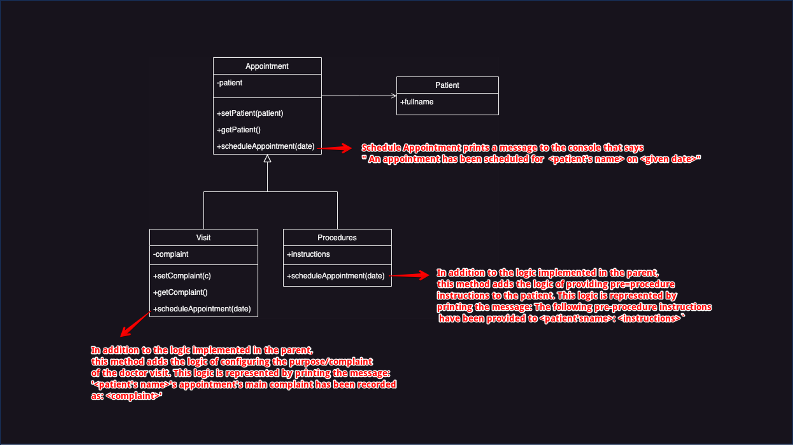
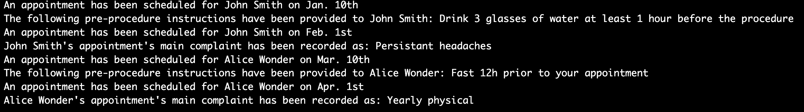

# SE2202_MiniProject1_Fall2023

Use the class notation to implement what's shown in the given diagram

+ indicate that those properties or fields are public, whereas a - indicate that you should protect those fields using information hiding. 

If a method is available in both the child and the parent class, you must use appropriate inheritance mechanism.

If a property is not listed in the classes, you do not need to store it. 

An appointment does not have a date until it is scheduled. 

## Using the classes

Use the classes you created to schedule different procedures and visit for some patients according to the following:  

* patient 1 - fullName: "John Smith"

* patient 2 - fullName: "Alice Wonder"

* Create an ultrasound procedure with the following instructions: 'Drink 3 glasses of water at least 1 hour before the procedure'

*Create a bloodwork procedures with the following instructions: 'Fast 12h prior to your appointment'

*Schedule an ultrasound procedure for John Smith on Jan. 10th

*Schedule a blood work procedure for Alice Wonder on Mar. 10th

*Create a visit for a complaint of Persistant headaches and schedule this visit for John Smith on Feb. 1st

*Create a visit for a complaint of Yearly physical and schedule this visit for Alice Wonder on Apr. 1st

## Expected Output

